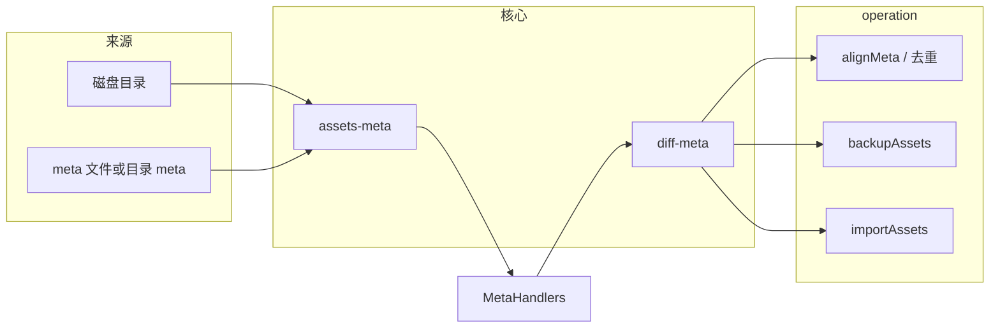

# assets-manage

目录资源元数据工具库：将某个根目录下的文件整理为**树形或列表形元数据**（含 `relativePath`、`sha1`、`shortId`、大小与日期等），在元数据之间做**差异对比**，并驱动**同步元数据、备份/拷贝文件、导入到新子目录**等操作。

主入口 `index.ts` 导出三块：`service`、`types`、`operation`。

## 核心概念（`types/`）

- **`AssetInfoFull`**（`asset.ts`）：单个文件的完整描述——路径、统计信息、`sha1` / `shortId` 等。
- **`AssetMeta`**（`dir-asset.ts`）：带 `rootDir` 的**树** `AssetTreeMeta`，或**扁平列表** `AssetListMeta`。
- **`MetaHandlers`**（`meta-handler.ts`）：对「某一 `rootDir` 的元数据」的抽象接口——读/写 meta、增删改条目等。典型实现为 **`getFileMetaHandler`**（`file-meta-handler.ts`）：从磁盘扫描生成树，或读/写 meta 文件。

## 服务层（`service/`）

| 模块                           | 作用                                                                                                                                                                                 |
| ------------------------------ | ------------------------------------------------------------------------------------------------------------------------------------------------------------------------------------ |
| **`assets-meta.ts`**           | 遍历目录生成 `AssetTreeMeta`（全量算 sha1：`getAssetFullInfoTreeMeta`；省成本：`getAssetPartialInfoTreeMeta`）；树与列表互转；读写目录/文件中的 meta；在树上插入、删除、查找节点等。 |
| **`asset-info.ts`**            | 单文件的 `getAssetInfo`、序列化、两版 `AssetInfo` 的字段级 `diff`。                                                                                                                  |
| **`diff-meta.ts`**             | **差异引擎**：`diffMetaForSyncUp`、`diffMetaForAddNew`，产出 `added` / `copied` / `moved` / `modified` / `deleted`（以及 import 场景的 `duplicated`）。                              |
| **`file-meta-handler.ts`**     | 将上述能力封装为 **`MetaHandlers`**，供 `operation` 注入使用。                                                                                                                       |
| **`short-id.ts`**、`config.ts` | 短 id 与常量（临时目录、日期后缀格式等）。                                                                                                                                           |

### `diffMetaForSyncUp(toMeta, fromMeta)`

- 以 **`relativePath`** 对齐两边的文件集合。
- 仅在 `from` 中存在的路径：`sha1` 在 `to` 中找不到 → **`added`**；若找得到且 `to` 中原路径已消失 → 同盘时尽量判为 **`moved`**，否则 **`copied`**。
- 两边都有的路径：按是否同一 `rootDir`，用 `sha1` / 日期 / 大小等判断 **`modified`**。
- 仅在 `to` 中存在的路径（且不是 move 的源路径）→ **`deleted`**。

### `diffMetaForAddNew(toMeta, fromMeta)`

- 按 **`sha1`** 对比：`from` 有而 `to` 无 → **`added`**；两边都有 → 记入 **`duplicated`**（用于导入时识别重复）。

## 业务操作（`operation/`）

1. **`1-assets-meta.ts` — 元数据对齐**
   - **`alignMeta(metaHandlers, fromMeta)`**：`diffMetaForSyncUp(当前 handler 的 meta, fromMeta)`，将差异写入带时间戳的快照文件，确认后在 **meta 层**执行 `createItems` / `updateItems` / `removeItems`（不拷贝物理文件，使记录的 meta 与 `fromMeta` 一致）。
   - **`alignMetaWithAssets`**：`fromMeta` 来自 **`getAssetPartialInfoTreeMeta(rootDir)`**（按当前磁盘扫描，减少重复计算）。
   - **`handleDuplicateFile`**：按 `sha1` 找重复，交互或 `short-name` 策略保留一份，其余移走/删除文件并 `removeItems` 更新 meta。

2. **`2-assets-backup.ts` — 按 meta 备份/同步**
   - **`backupAssets(toMetaHandlers, fromMetaHandlers)`**：两个不同 `rootDir`。`diffMetaForSyncUp` 后，在 **`to` 目录**上执行 copy/move/delete，并调用 `toMetaHandlers` 的 `createItem` / `removeItem` 等与磁盘一致。

3. **`3-assets-import.ts` — 导入到新子目录**
   - **`importAssets(to, from, { newAssetsDir })`**：用 **`diffMetaForAddNew`** 找出 `from` 相对 `to` 多出的内容，确认后将文件拷到 **`to.rootDir/newAssetsDir/...`**，并批量 **`createItems`**（每 800 条批量写入）。

## `external.ts`

再导出上层公共模块（路径工具、`goOnOrNot`、写文件、`moveFile` 等），供本包 `service` / `operation` 使用。

## 数据流（概览）



## 目录结构

```
.
├── README.md
├── external.ts
├── index.ts
├── operation
│   ├── 1-assets-meta.ts
│   ├── 2-assets-backup.ts
│   ├── 3-assets-import.ts
│   └── index.ts
├── service
│   ├── asset-info.ts             单文件信息：生成、比较、序列化
│   ├── assets-meta.ts            AssetTree / 列表 的读写与遍历
│   ├── config.ts
│   ├── diff-meta.ts              两份 AssetMeta 之间的差异
│   ├── file-meta-handler.ts      封装为 MetaHandlers，更新 AssetTree
│   ├── index.ts
│   └── short-id.ts               short-id 相关操作
└── types
    ├── asset.ts
    ├── assets-meta.ts
    ├── dir-asset.ts
    ├── index.ts
    ├── meta-handler.ts
    └── meta-meta.ts
```

`test/` 目录包含针对上述模块的测试与生成器辅助代码。
